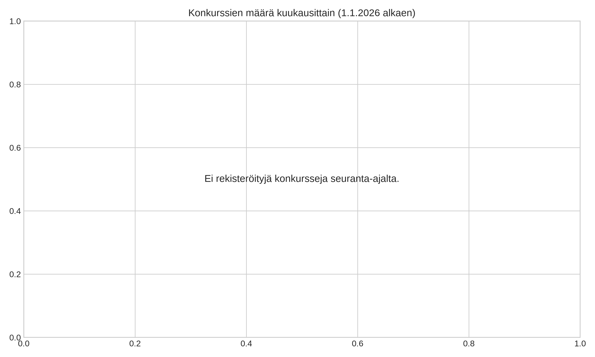
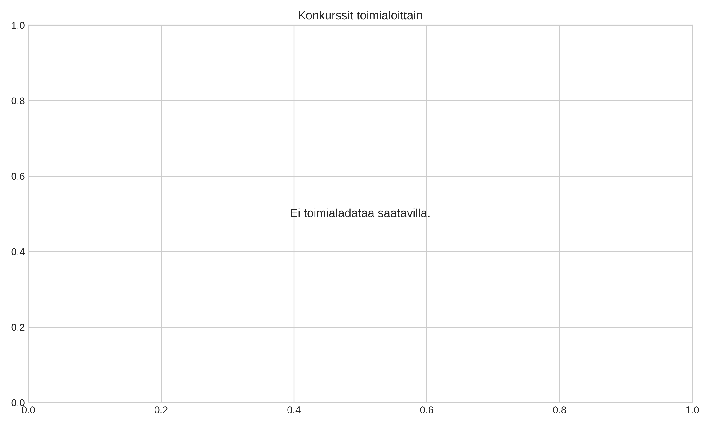

# Satakunnan ja lähialueiden konkurssiseuranta

**Päivitetty:** 2026-08-28 13:34:25  
**Aikaraja:** 1.1.2026 alkaen (Kumulatiivinen)  
**Seurattavat kunnat (12 kpl):** Eurajoki, Harjavalta, Jämijärvi, Kankaanpää, Karvia, Kokemäki, Merikarvia, Nakkila, Pomarkku, Pori, Siikainen, Ulvila

---

## 📊 Kuukausittainen kehitys

---

## 🏭 Konkurssit toimialoittain

---

## 📋 Yhteenvetotaulukko

_Ei rekisteröityjä konkurssimerkintöjä valitulta ajanjaksolta._

---
*Raportti luotu automaattisesti PRH:n avoimen rajapinnan (avoindata.prh.fi) pohjalta GitHub Actions -työvuon toimesta.*
